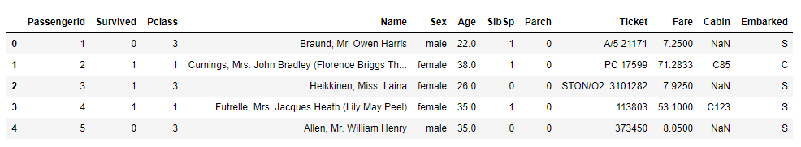
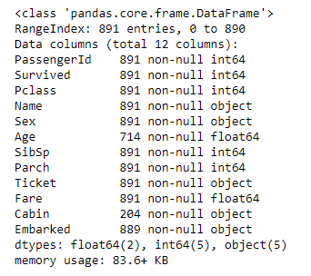
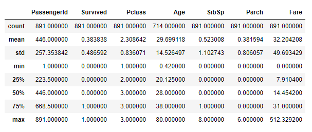
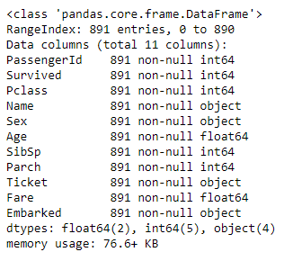
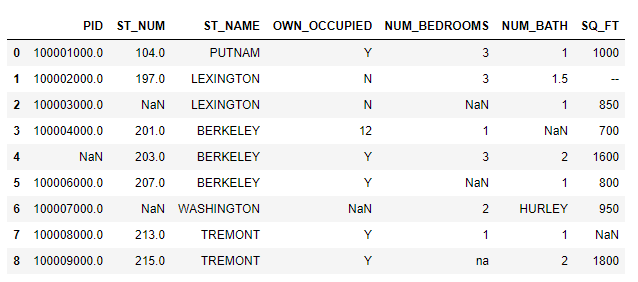
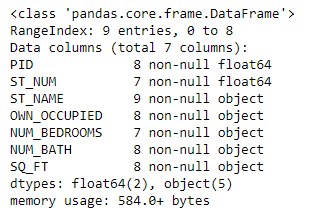
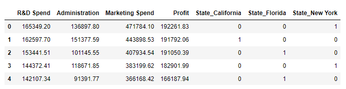
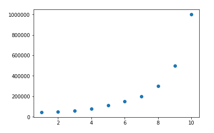
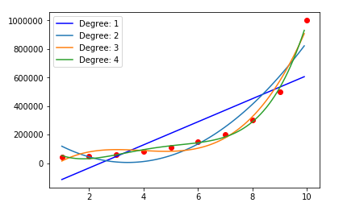

# Data Preprocessing for Machine Learning

## Summary

As the saying goes, "garbage in, garbage out." With that being said, we can begin to understand why data preprocessing is so important and why the most time is allocated in this phase of the pipeline.

## Data Preprocessing Libraries

NumPy and Pandas are essential for data wrangling.
Matplotlib can be used to create visualizations.

```Python
import pandas as pd
import numpy as np
import matplotlib.pyplot as plt
```

The sklearn.preprocessing library has many classes and methods for data preprocessing as we will see later.

## Import/Load Dataset

When working with structured datasets, we will mainly deal with two types of data structures:
  - Pandas DataFrames
  - NumPy Arrays

Both tells the same story but each uses different methods and libraries for data preprocessing.
Most datasets are managed and imported as DataFrames but most libraries, like scikit-learn, takes in Arrays as an input for its classes. That is why it is important to be comfortable wrangling in both formats.

First we will look at converting from a Pandas DataFrame to a NumPy Array and vice versa.

```Python
## Loading Dataset as Pandas DataFrame
dataset = pd.read_csv('./datasets/50_Startups.csv')
column_names = dataset.columns

## Convert Pandas DataFrame to NumPy Arrays, Method 1
array1 = dataset.values
## Method 2
array2 = np.array(dataset)

## Convert NumPy Arrays to Pandas DataFrame
df = pd.DataFrame(array1, columns=column_names)
```

## Verifying Contents using Pandas

Using Pandas we can quickly verify the contents of a dataset we import.

```Python
## loading dataset
df = pd.read_csv('./datasets/titanic-train.csv')

## Quickly check contents of the dataset
df.head()
```

Output:


We can also get a quick summary of the dataset.
```Python
## Summary of dataset
df.info()
```

Output:


We can also generate a statistical summary of all the numerical columns in our dataset.

```Python
## Statistical summary of dataset
df.describe()
```

Output:


## Missing Data

In a perfect world, we will have all the data readily available in clean format but unfortunately you will come across datasets with missing data. There are a few methods of dealing with missing data.

One way of dealing with missing data is to drop all rows with missing values.

```Python
## Drop all NaNs
df.dropna()
## Drop based on Threshold, percentage(50%) of NaN values in a column
df.dropna(thresh=int(df.shape[0] * 0,5), axis=1)
```

When we drop all the NaN values, we are only left with a dataset with 183 row and 12 columns while dropping columns based on our 50% threshold we were left with a dataset with 891 rows and 11 columns. As we can see dropping missing values may not always be so favorable as we are prone to lose valuable information. In this case we can use statistical measures to fill the missing data, such as central tendency measures like mean, median, or mode. When to use mean, median, or mode will vary case by case. For this example we will use the mean to fill missing values.

```Python
## Central Tendency Measures
mean = df.mean()
median = df.median()

## Numerical Data (By Mean or Median)
df.fillna(mean, inplace=True)

## Categorical Data (By Mode)
df['Embarked'].fillna(df['Embarked'].mode()[0], inplace=True)
df.info()
```

After dropping the column, 'Cabin', with more than 50% NaN values and filling in the missing values of the 'Age' and 'Embarked' columns, we get the new dataset summarized below.

Output:


Missing values can also be filled using the scikit-learn preprocessing library and the Imputer class on NumPy arrays.

```Python
from sklearn.preprocessing import Imputer
df = pd.read_csv('./datasets/titanic-train.csv')
## Convert to NumPy array
df = df.values
age = df[:,5].reshape(len(df),1)

## Fit and Transform to fill missing values
imputer = Imputer(strategy='mean')
imputer = imputer.fit(age)
age = imputer.transform(age)
df[:,5] = array.reshape(df[:,5].shape)
```

Above we were looking at examples of standard missing values, which are defined as NaN. In real life, for example, a user may have forgot to fill in a field or information may be lost when manually inputting data. In these cases we may be dealing with non-standard missing values, in which the methods above would not work.

```Python
df = pd.read_csv('./datasets/property_data.csv')
df

df.info()
```

Output:



From a quick glance we can see that there are missing values in the form of '--', and 'na'. Also looking at the summary of the dataset we can expect the SQ_FT, NUM_BATH, NUM_BEDROOMS columns to be a float datatype, but this is not the case. We can already start to see the non-standard missing values in our data.

If we know the specific forms of missing values we are working with we can use Pandas to account for them.

```Python
missing_values = ["na", "--"]
df = pd.read_csv('./datasets/property_data.csv', na_values = missing_values)
df
```

This converts all values defined in the missing_values list as NaN values in our dataset.

There are times when we have unexpected values in our dataset, in the form of typos and incorrect data. For example, in the OWN_OCCUPIED columns we should expect a binary input of either yes or no but we can see that there is an integer value of 12. This is obviously a mistake and we would need a method of detecting these errors. This is when writing a test script would come in handy.

```Python
def test_column(column):
    index=[]
    for i,v in enumerate(column):
        try:
            int(v)
            index.append(i)
        except:
            continue

    return index

test_column(df['OWN_OCCUPIED'])
```

In the example above, we expected a value of yes or no. I wrote a simple script that tests whether the datatype is a string or an integer using try and except error testing. The script will return a list of the indexes of where we got an error.

## Encoding Categorical Data

Machines learning algorithms are only able to interpret numerical data. When dealing with categorical data we need to transform and encode our data so that we can utilize them.

Encoding categorical can be done on DataFrames using Pandas or on Arrays using scikit-learn preprocessing tools. When encoding ordinal data, I would use Pandas mapping function or the LabelEncoder library from scikit-learn.

```Python
df = pd.read_csv('./datasets/50_Startups.csv')

## Creating dummy variables for our categorical data
pd.get_dummies(df).head()

## Note: We can map and transform a column on Pandas using key, value pairs in the form of dictionaries.
```

Output:


Using LabelEncoder and OneHotEncoder we can transform and create dummy variables of our categorical data.

```Python
from sklearn.preprocessing import LabelEncoder, OneHotEncoder
## Encoding Categorical Data
labelencoder = LabelEncoder()
X = df.values
X[:,3] = labelencoder.fit_transform(X[:,3])
## Creating dummy variables using OneHotEncoder
onehotencoder = OneHotEncoder(categorical_features = [3])
X = onehotencoder.fit_transform(X).toarray()
```

## Polynomial Feature

Creating polynomial features is a way of adding complexity to the numeric input data. Polynomial features are created when there is a nonlinear relationship between the feature and the target. We can create polynomial features using scikit-learn.

```Python
from sklearn.preprocessing import PolynomialFeatures
df = pd.read_csv('./datasets/Position_Salaries.csv')
plt.scatter(y=df.values[:,-1], x=df.values[:,1])
```

Output:


We can see that there is a nonlinear relationship between the feature and the target. Using polynomial features, we can find the polynomial degree that best represent this relationship.

```Python
## Transform Features into Polynomial Features
from sklearn.linear_model import LinearRegression
poly2 = PolynomialFeatures(degree=2)
deg2 = poly2.fit_transform(X.reshape(-1,1))
poly3 = PolynomialFeatures(degree=3)
deg3 = poly3.fit_transform(X.reshape(-1,1))
poly4 = PolynomialFeatures(degree=4)
deg4 = poly4.fit_transform(X.reshape(-1,1))

## Fit Linear Regression to each Degree of polynomial features
lr = LinearRegression()
lr.fit(X.reshape(-1,1), y)
lr2 = LinearRegression()
lr2.fit(deg2, y)
lr3 = LinearRegression()
lr3.fit(deg3, y)
lr4 = LinearRegression()
lr4.fit(deg4, y)

## Visualize the relationship between the polynomial features and target
X_grid = np.arange(min(X), max(X), 0.1)
X_grid = X_grid.reshape((len(X_grid),1))
plt.scatter(X, y, color='r')
plt.plot(X_grid, lr.predict(X_grid), color='b', label='Degree: 1')
plt.plot(X_grid, lr2.predict(poly2.fit_transform(X_grid.reshape(-1,1))), label='Degree: 2')
plt.plot(X_grid, lr3.predict(poly3.fit_transform(X_grid.reshape(-1,1))), label='Degree: 3')
plt.plot(X_grid, lr4.predict(poly4.fit_transform(X_grid.reshape(-1,1))), label='Degree: 4')
plt.legend()
```

Output:


## Feature Scaling

It is good practice to apply feature scaling to get all our features in similar scale. As a rule of thumb, we want all the features to be within the range -1 and 1.
When applying gradient descent, feature scaling will allow the algorithm to converge faster in minimizing our cost function. Feature scaling is essential when working with algorithms that are based on distance computation, such as clustering, K-Nearest Neighbor, and Support Vector Machine. Although on Python, linear regression, logistic regression, and tree-based models do not require feature scaling.

One method of feature scaling is called the Mean Normalization. This scales the feature to have a mean of 0 and standard deviation of 1. Mean Normalization is applied by subtracting by the mean divided by the standard deviation.

```Python
## Mean Normalization
df = pd.read_csv('./datasets/Social_Network_Ads.csv')
df['Age'] = (df['Age'] - df['Age'].mean()) / df['Age'].std()
df['EstimatedSalary'] = (df['EstimatedSalary'] - df['EstimatedSalary'].mean()) / df['EstimatedSalary'].std()
```

Another method of feature scaling is called Min-Max Scaling. This scales the features to a range between 0 and 1. Minmax Scaling is applied by subtracting by the min divided by the range, max - min.

```Python
## Min-Max Scaling
df = pd.read_csv('./datasets/Social_Network_Ads.csv')
df['Age'] = (df['Age'] - df['Age'].min()) / (df['Age'].max() - df['Age'].min())
df['EstimatedSalary'] = (df['EstimatedSalary'] - df['EstimatedSalary'].min()) / (df['EstimatedSalary'].max() - df['EstimatedSalary'].min())
```

Mean normalization and min-max scaling can be done using the preprocessing library on scikit-learn using the StandardScaler and MinMaxScaler classes.

```Python
## Mean Normalization and Min-Max Scaling using scikit-learn
from sklearn.preprocessing import StandardScaler, MinMaxScaler
df = pd.read_csv('./datasets/Social_Network_Ads.csv')
features = df.iloc[:, [2,3]].values
sc = StandardScaler()
minmax = MinMaxScaler()
mean_normalize = sc.fit_transform(features)
minmax_scale = minmax.fit_transform(features)
```

When using the min-max scaling method, there is a loss of impact of our outliers. When we want to preserve the importance of our outliers, we would use the mean normalization.
